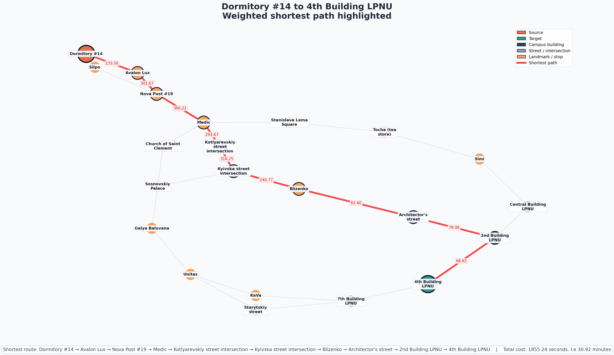

[English](#english) | [Українська](#українська)

<a id="english"></a>
# Shortest Route: Dormitory 14 to Lviv Polytechnic

A personal project visualizing the optimal pedestrian route from Dormitory #14 to Lviv Polytechnic National University (Building 4) using spatial network analysis.

## Features
* Builds a transport and landmark graph using defined edges in `main.py`.
* Calculates the weighted shortest path using `networkx`.
* Renders a color-coded PNG (`graph_visualization.png`) complete with labels and a legend for readability.

## Theoretical Background

### Shortest Path Algorithm
This project uses **Dijkstra's Algorithm** to evaluate the graph. Because all physical edge weights (representing time) are strictly positive, Dijkstra's is mathematically guaranteed to find the optimal shortest path efficiently.

### Edge Weight Calculation (Time Cost)
Edge weights represent the total traversal time in seconds. The formula combines physical movement time—derived from **Tobler's Hiking Function**—with discrete obstacle penalties.

**Tobler's Velocity Formula:**
Tobler's function calculates the walking speed based on the path's slope:

$$V = 6 \cdot e^{-3.5 \cdot |s + 0.05|}$$

*   **$V$**: Walking velocity in **km/h**.
*   **$s$**: Slope of the path (change in elevation divided by horizontal distance).
*   **$-0.05$**: An offset accounting for the biomechanical reality that hikers achieve maximum speed at a slight downward grade of approximately 5%.

**Total Edge Weight Formula:**
To calculate the total time weight in seconds, we apply the velocity to the distance and add penalties:

$$w = \frac{d}{\frac{6 \cdot e^{(-3.5 \cdot |s + 0.05|)}}{3.6}} + \sum_{i=1}^{n}c_i$$

*   **$w$**: Total edge weight (time in seconds).
*   **$d$**: Distance between the two points in meters.
*   **$c_i$**: Additional fixed time costs in seconds (e.g., waiting at traffic lights, crossing safety delays).
*   *Note:* The Tobler formula yields km/h. Dividing the denominator by **3.6** converts this velocity to **m/s**. Dividing the distance ($d$) by this m/s velocity gives the base time in seconds.

## Installation

Ensure you have Python installed, then install the required dependencies:

```bash
pip install -r requirements.txt

```

## Usage

Execute the main script to compute the route and generate the graph:

```bash
python3 main.py

```

## Output

After a successful run, the script generates the following visualization file in the root directory:

* `graph_visualization.png`

---
---


<a id="українська"></a>
# Найкоротший маршрут: Гуртожиток №14 – Львівська політехніка

Особистий проєкт для візуалізації оптимального маршруту від гуртожитку №14 до Національного університету "Львівська політехніка" (IV навчальний корпус) за допомогою просторового мережевого аналізу.

## Функціонал

* Створює транспортний граф та граф орієнтирів, використовуючи задані ребра у `main.py`.
* Обчислює найкоротший зважений шлях за допомогою `networkx`.
* Генерує PNG-зображення (`graph_visualization.png`) з мітками та легендою для зручності читання.

## Теоретичне підґрунтя

### Алгоритм найкоротшого шляху

Цей проєкт використовує **алгоритм Дейкстри** для аналізу графа. Оскільки всі фізичні ваги ребер (що представляють час) є строго додатними, алгоритм математично гарантує ефективне знаходження оптимального найкоротшого шляху.

### Розрахунок ваги ребра (Витрати часу)

Ваги ребер представляють загальний час проходження в секундах. Формула поєднує час фізичного руху — розрахований за допомогою **функції ходьби Тоблера** — з дискретними штрафами за перешкоди.
Дискретні штрафи були створені на основі мого особистого досвіду :) з урахуванням особливості інфраструктури, трафіку тощо.

**Формула швидкості Тоблера:**
Функція Тоблера розраховує швидкість ходьби на основі нахилу шляху:

$$V = 6 \cdot e^{-3.5 \cdot |s + 0.05|}$$

* **$V$**: Швидкість ходьби у **км/год**.
* **$s$**: Нахил шляху (зміна висоти, поділена на горизонтальну відстань).
* **$0.05$**: Невеликий оффсет - пішоходи досягають максимальної швидкості при невеликому спуску приблизно на 5% згідно Тоблера.

**Загальна формула ваги ребра:**
Щоб обчислити загальну вагу часу в секундах, ми застосовуємо швидкість до відстані та додаємо штрафи:

$$w = \frac{d}{\frac{6 \cdot e^{(-3.5 \cdot |s + 0.05|)}}{3.6}} + \sum_{i=1}^{n}c_i$$

* **$w$**: Загальна вага ребра (час у секундах).
* **$d$**: Відстань між двома точками в метрах.
* **$c_i$**: Додаткові фіксовані витрати часу в секундах (наприклад, очікування на світлофорах, затримки на переходах).
* *Примітка:* Формула Тоблера дає результат у км/год. Ділення знаменника на **3.6** перетворює цю швидкість у **м/с**. Ділення відстані ($d$) на цю швидкість (м/с) дає базовий час у секундах.

## Встановлення

Переконайтеся, що у вас встановлено Python, потім встановіть необхідні залежності:

```bash
pip install -r requirements.txt

```

## Використання

Запустіть головний скрипт:

```bash
python3 main.py

```

## Результат

Після успішного запуску скрипт генерує наступний файл:

* `graph_visualization.png`

---

